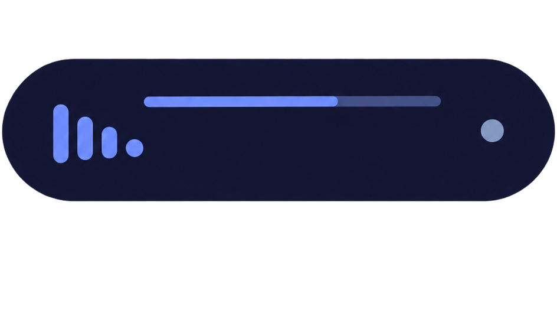

  

<h1 align="center">灵动词岛 for SPW</h1>

为 Salt Player for Windows 制作的桌面歌词词岛。

  
  
  

把 SPW 当前播放的歌词放到桌面上方，支持逐字歌词、翻译、AMLL 风格动效、专辑封面与取色、播放控制，以及 Windows 下的实时频谱、鼠标穿透和全屏自动隐藏。

QQ 交流群：`1054809039`

## 功能

- 逐字高亮、翻译、长音强调、辉光和歌词切换动效；
- 胶囊 / 刘海外观，支持圆角、宽度、透明度、字体和多种封面取色；
- 悬停展开上一首、播放 / 暂停、下一首和可拖动进度条；
- 九宫格拖动吸附，顶部和底部会自动调整展开方向；
- Windows 可显示 SPW 进程的四频段实时频谱，并支持鼠标穿透、悬停隐藏和全屏隐藏；
- Linux x64 提供实验性支持，共用主要歌词与界面功能。

详细设置见 [使用与设置](docs/usage.md)，平台差异见 [兼容性与限制](docs/compatibility.md)。

## 安装

1. 前往 [Releases](https://github.com/GaBoron/Dynamic-Lyrics-Island-for-SPW/releases/latest) 下载与你的平台对应的插件 ZIP；
2. 在 SPW 的创意工坊 / 插件管理中导入；
3. 启用插件并播放一首已经有歌词的歌曲。

Windows 使用 `windows-x64` 包；Linux 使用 `linux-x64` 包。不要导入带 `-source` 后缀的源码包。

如果当前 SPW 没有导入入口，或者想了解 Linux 运行环境，请看 [安装与更新](docs/installation.md)。

本插件只显示 SPW 已经加载的歌词，不负责联网搜索。需要自动获取逐字歌词时，可以搭配 [SPW-Lyrics](https://github.com/GaBoron/SPW-Lyrics)。

## 平台

| 平台 | 状态 |
| --- | --- |
| Windows 10 / 11 x64 | 主要支持平台 |
| Linux x64 | 实验性支持 |
| macOS | 暂无计划 |

Linux 当前没有 Windows 的进程实时频谱、鼠标穿透和前台全屏检测等能力，具体差异见 [兼容性与限制](docs/compatibility.md)。

## 文档

- [安装与更新](docs/installation.md)
- [使用与设置](docs/usage.md)
- [故障排查](docs/troubleshooting.md)
- [兼容性与限制](docs/compatibility.md)
- [开发指南](docs/development.md)

完整文档入口在 [`docs/README.md`](docs/README.md)。

## 反馈与贡献

遇到问题或有功能想法，可以直接开 [Issue](https://github.com/GaBoron/Dynamic-Lyrics-Island-for-SPW/issues)。

较大的功能、UI 行为或平台改动建议先在 Issue 里把目标和范围说清楚，再开始完整实现；小型修复和文档修改可以直接提交 PR。项目的代码边界和贡献习惯写在 [开发指南](docs/development.md) 中。

## 许可与致谢

灵动词岛原创：Lyricify / WXRIW（XY Wang）。本项目依据 [CC BY-SA 4.0](https://github.com/WXRIW/Lyricify-App#lyricify-原创) 独立实现，并非 Lyricify 官方产品。

AMLL 动画移植模块采用 AGPL-3.0-only，其他程序采用 GPL-3.0-only；视觉、交互改编及文档采用 CC BY-SA 4.0。

详见 [NOTICE](NOTICE)、[第三方许可说明](THIRD_PARTY_NOTICES.md) 和 [LICENSE](LICENSE)。
